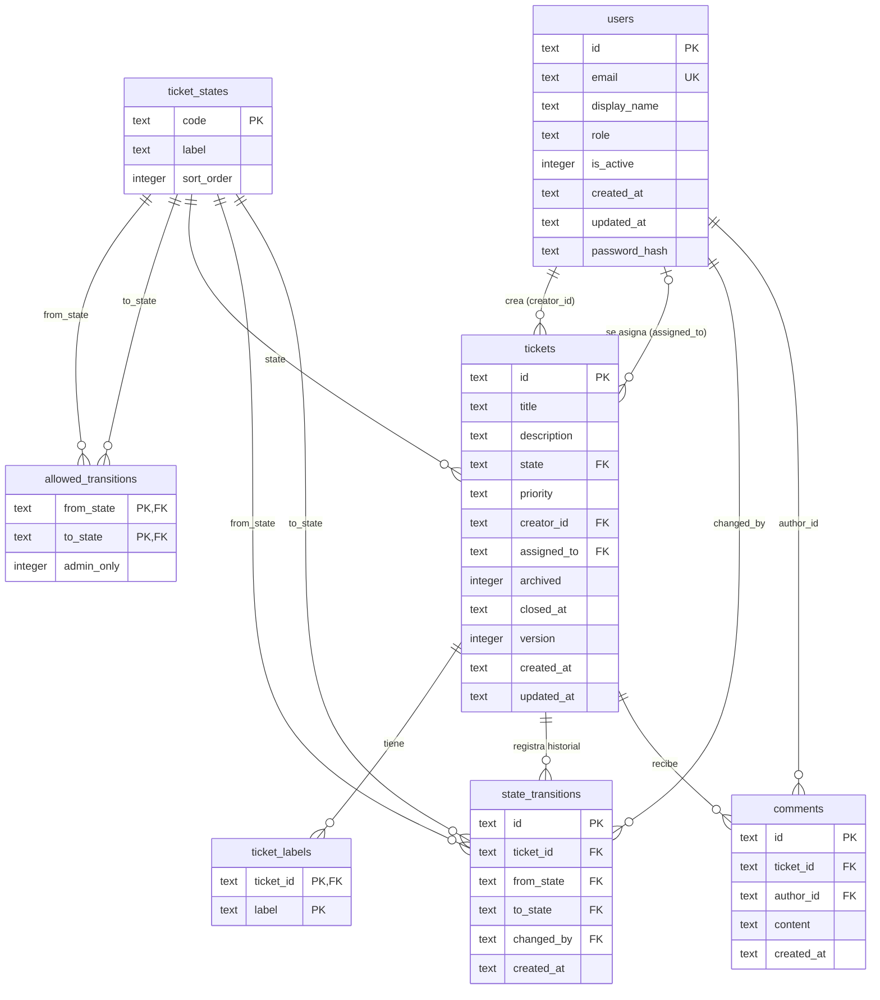

# ER Diagram — Mini Jira

## Notas de diseño

| Decisión | Motivo |
|---|---|
| `ticket_states` como tabla, no enum | Permite agregar estados vía INSERT sin migrar el schema |
| `allowed_transitions` con `admin_only` | Fuente de verdad de la máquina de estados; el backend la consulta en vez de hardcodear la lógica |
| `from_state NULL` en `state_transitions` | Representa la creación inicial del ticket (sin estado previo) |
| `version INT` en `tickets` | Optimistic locking: el backend rechaza escrituras con versión desactualizada (409) |
| `closed_at` texto ISO 8601 | Garantiza coherencia: solo se asigna cuando `state = 'listo'`; se limpia si se regresa |
| Borrado lógico en tickets | Los tickets solo se archivan (`archived = 1`); no hay borrado físico |
| `ON DELETE CASCADE` en `ticket_labels` | Las etiquetas son datos derivados del ticket |
| Sesiones en MemoryStore | express-session con MemoryStore; solo para entorno de desarrollo |
| Tipos SQLite | Todos los UUIDs y timestamps se almacenan como `text`; booleanos como `integer` (0/1) |
| `password_hash` en `users` | Contraseña hasheada con bcrypt; nunca se expone en respuestas de API |
