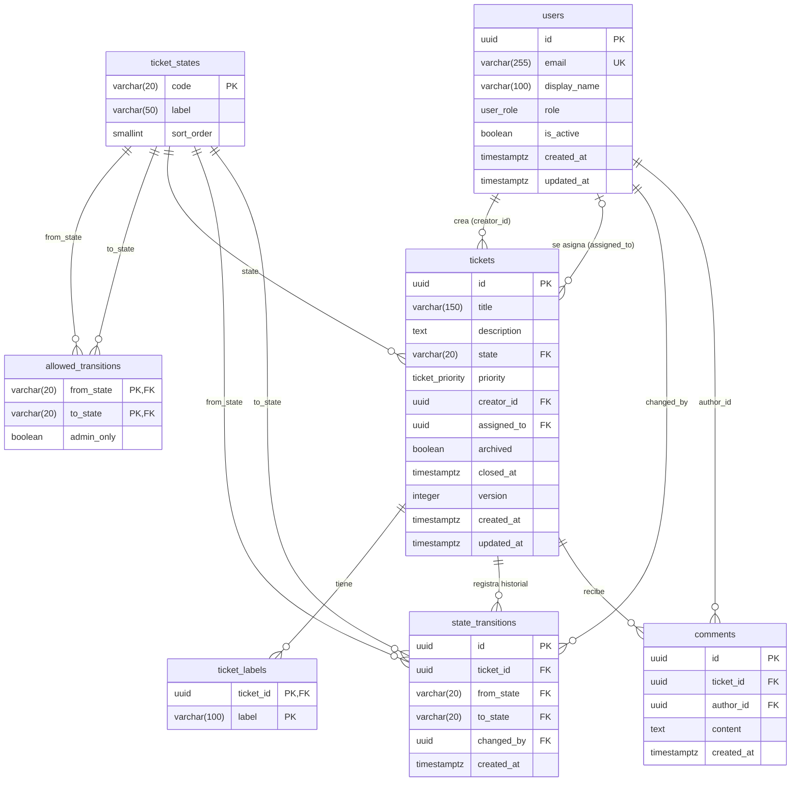

# ER Diagram — Mini Jira

## Notas de diseño

| Decisión | Motivo |
|---|---|
| `ticket_states` como tabla, no enum PG | Permite agregar estados vía INSERT sin migrar el schema (riesgo R-03 del spec) |
| `allowed_transitions` con `admin_only` | Fuente de verdad de la máquina de estados; el backend la consulta en vez de hardcodear la lógica |
| `from_state NULL` en `state_transitions` | Representa la creación inicial del ticket (sin estado previo) |
| `version INT` en `tickets` | Optimistic locking: el backend rechaza escrituras con versión desactualizada (409) |
| `closed_at` con CHECK constraint | Garantiza coherencia a nivel de fila: solo puede existir si `state = 'listo'` |
| `ON DELETE RESTRICT` en `state_transitions` y `comments` | Los tickets solo se archivan lógicamente (`archived = true`); no hay borrado físico |
| `ON DELETE CASCADE` en `ticket_labels` | Las etiquetas son datos derivados del ticket; se eliminan junto a él si se borrara físicamente |
| Sessions en Redis, no en PostgreSQL | Confirmado por el diagrama de secuencia: Redis actúa como session store |
