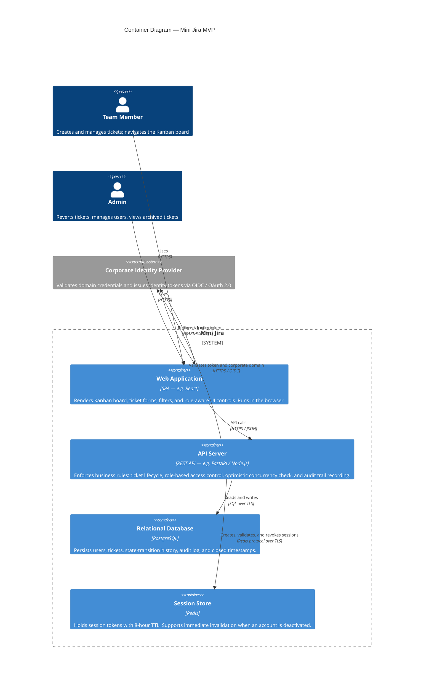

# C4 Container Diagram — Mini Jira MVP

## Key Architectural Decisions

| Requirement | Container decision |
|---|---|
| Corporate domain auth (HU-01) | External IdP — domain check delegated, not home-grown |
| 8-hour session expiry (HU-01) | Redis TTL — avoids polling the DB on every request |
| Immediate invalidation on deactivation (HU-01) | Redis key deletion by the API on account deactivation event |
| Audit trail + timestamps (HU-02) | Persisted in PostgreSQL alongside state-transition rows |
| Optimistic concurrency (HU-02) | Version/ETag check enforced at the API layer before any write |
| Archived ticket filter (HU-03) | `is_archived` flag in DB; API filters by default unless admin requests otherwise |
